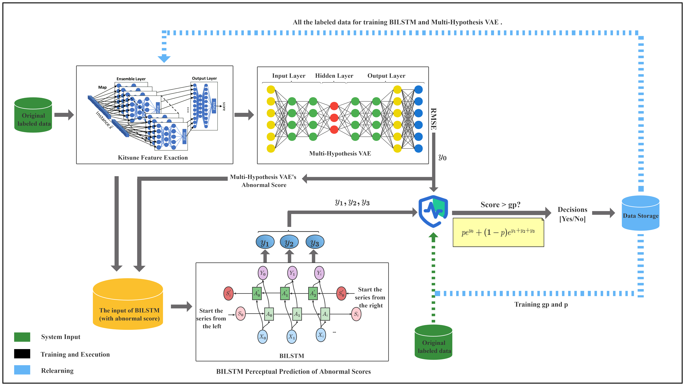
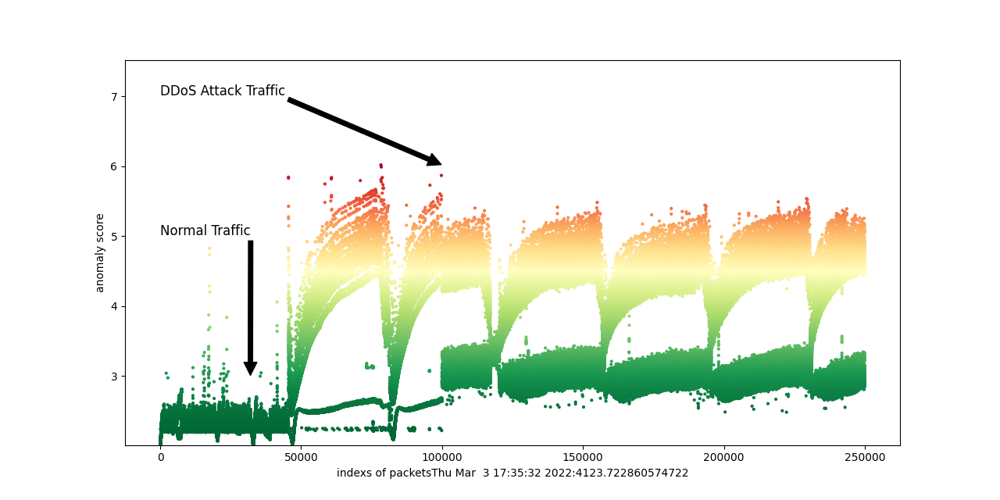

# VARU

Varu is an online anomaly detection model based on multi hypothesis learning, which can effectively deal with all kinds of daily network intrusion. As shown below.



# Usage

## Implementation details

This program is implemented with `Python 3.8`, and all the requirements are listed in `requirements.txt`

## Running the demo example

- Installing the requirements:

  ```
  pip install -r requirements.txt
  ```

- Running the demo script:

  ```
  python demo.py
  ```

- After running the program, the result will be show in the following figure:

  

- This figure shows how the anomaly score of the samples varies before and after the DDoS attack, it can be seen that the anomaly scores increase dramatically after the DDoS happens.

